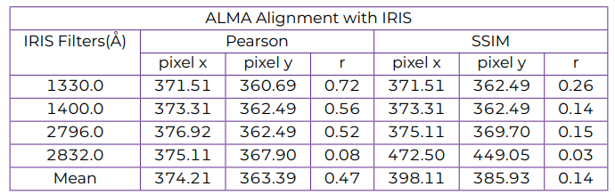
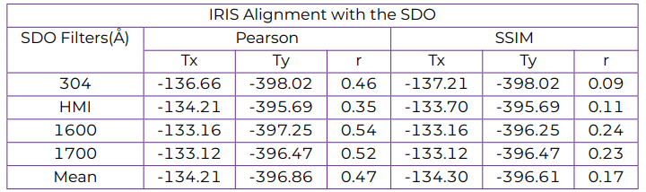

# Alignment of IRIS, ALMA, and SDO Images

## Introduction
This project presents a  code for aligning images from the Atacama Large Millimeter/submillimeter Array (ALMA), Interface Region Imaging Spectrograph(IRIS), and Solar Dynamics Observatory (SDO) telescopes, focusing on co-observations. The code specifically targets the alignment of images from the D06 region within the Solar ALMA Science Archive (SALSA) database, offering functions to align IRIS with  ALMA, IRIS with SDO, and SDO with ALMA.

## Motivation and objetives
The primary motivation for this project arises from the challenges associated with studying the dynamic and continuously changing physical conditions of the solar atmosphere. Accurately comparing different regions and understanding the underlying physical phenomena require robust data processing techniques. 

In the field of solar physics, research often emphasizes specific research objectives, leading to limited discussions about data preprocessing in academic literature. This gap highlights the need for a dedicated preprocessing method that can address the complexities of analyzing data from telescopes like IRIS, SDO, and ALMA.

Recognizing this need, our project introduces an innovative preprocessing method designed to spatially and temporally synchronize images from these diverse telescopes. This alignment technique is crucial for enhancing the quality and reliability of data analysis, thereby enabling a deeper and more accurate understanding of the solar atmosphere's dynamics.

## Features
- Precise alignment based on SDO helioprojective coordinates.
- Utilization of Pearson Correlation Coefficient (PCC) and Structural Similarity Index (SSIM) for image comparison.
- Application to diverse solar observations from ALMA, IRIS, and SDO.

## Methodology: Alignment Process Summary

### Data Acquisition
- Systematic download and selection of data from ALMA, IRIS, and SDO, with a focus on observations of the same solar region.
- Utilization of the SALSA database for identifying regions observed by ALMA in co-observation with IRIS and SDO.
- The data used for the alignment were  IRIS telescope at wavelengths Mg II wing 2832\,Å, Mg II h/k 2796\,Å, C II 1330\,Å, and Si IV 1400 Å, SDO/AIA at wavelength 304\,Å , 1600\,Å, 1700\,Å  and  SDO/HMI.

### Data Preparation
- Rotation of SDO and ALMA images using header values to align with solar north.

### Alignment of ALMA Images with IRIS
1. **Rescaling IRIS Images:** 
   - IRIS images were rescaled to match the pixel size of ALMA, using the ratio of pixel sizes in arcseconds as the scaling factor.

2. **Selecting and Preparing Images:**
   - Selected IRIS frames that were co-observed with ALMA.
   - Averaged and interpolated these images to normalize the intensity scale (range: 0 to +1), applying the same process to ALMA data.

3. **Correlation Analysis:**
   - Performed correlation analysis between the processed IRIS and ALMA images.
   - Utilized Pearson Correlation Coefficient (PCC) and Structural Similarity Index (SSIM) to determine alignment.
   - Identified the pixel positions in IRIS images with maximum correlation to ALMA images.

4. **Finalizing Alignment:**
   - Averaged the coordinates of maximum correlation for all IRIS filters to determine the alignment position within the IRIS array.

### Alignment of IRIS Images with SDO
1. **Cropping IRIS Frames:**
   - Cropped IRIS frames centered on the pixel of maximum correlation with ALMA.
   - Ensured the new Field of View (FoV) of IRIS images was slightly larger than ALMA's FoV.

2. **Rescaling and Preparing Images:**
   - Rescaled cropped IRIS images to match the pixel size of SDO.
   - Selected corresponding cropped IRIS and SDO frames that were co-observed with ALMA.
   - Averaged and interpolated these frames to normalize the intensity scale.

3. **Correlation Analysis for Alignment:**
   - Conducted correlation analysis between the cropped IRIS and SDO images.
   - Estimated and stored PCC and SSIM coefficients for each mapping.

4. **Determining Alignment Position:**
   - Identified pixel positions in the SDO matrix showing maximum correlation with IRIS images.
   - Calculated helioprojective coordinates for these positions using SDO data headers.

5. **Final Alignment Outcome:**
   - Averaged helioprojective coordinates for all SDO filters.
   - Aligned IRIS images with SDO, and consequently aligned ALMA images

The process is optimized to limit computational costs, including strategic cropping to narrow the search range for maximum correlations. The entire procedure is implemented in Python. More details on this process will be available in an upcoming article, with the DOI to be added to this README upon publication.

## Results and Analysis

### Alignment of ALMA Images with IRIS
- The pixel positions for maximum correlation between ALMA and IRIS images were determined, showing less than a 2% discrepancy in most cases.
- An exception was noted with IRIS 2832Å images, where a discrepancy of about 26% was observed due to observational differences in solar layers.
- The Pearson Correlation Coefficient (PCC) method was preferred over the Structural Similarity Index (SSIM) due to its reliability and computational efficiency.

### Alignment of IRIS Images with SDO
- The alignment process involved averaging and interpolating the IRIS and SDO images, followed by a correlation analysis.
- The average helioprojective coordinates obtained were $T_x$ = -134.21 and $T_y$ = -396.86, with minor discrepancies compared to the SALSA database.

### Visual Representation
- Figures depicting the alignment results show clear correlations between the thermal structures observed by ALMA and the corresponding observations from IRIS and SDO.

## Conclusions

- The alignment process effectively synchronizes ALMA and IRIS images using SDO helioprojective coordinates as a reference.
- The method shows high accuracy with minimal discrepancies, proving its effectiveness in aligning solar images from different telescopes.
- This technique is versatile and can be adapted for use with other telescopes, considering the emission line formation heights for effective correlation.
- Future enhancements could include an advanced alignment approach considering projection effects, further refining the precision of the alignment process.

### Note: In the function_that_we_used_and_information folder, you'll find essential tools for astronomical image processing, including a function for aligning ALMA images with SDO and IRIS with SDO. Additionally, the folder contains a convenient script for downloading SDO data from the JSOC database.
##
In the PDF files Aligning ALMA and IRIS images using SDO.pdf and Comparative_Aligning ALMA and IRIS images using SDO.pdf, we present interactive posters that showcase how the proposed method aligns ALMA and IRIS images using SDO data. These interactive materials provide an in-depth and clear understanding of our methodology, offering a comprehensive and engaging view of the alignment process.

### Table 1. Results of the alignment of the IRIS images with the ALMA images for region D06 from the SALSA database, corresponding to the observation of April 12, 2018 at 12:15 UTC

### Table 2. Results of the alignment of the IRIS images with the SDO images for region D06 from the SALSA database, corresponding to the observation of April 12, 2018 at 12:15 UTC

### Figure 1. Result of the alignment ALMA Band 3, SDO, and IRIS for region D06 of the SALSA database, corresponding to the observation of April 12, 2018 at 12:15 UTC. The blue circle represents the ALMA FoV, which is centered on the helioprojective coordinates Tx, Ty = -134.21 -396.86, which were estimated during the alignment process. The regions of the chromosphere with a brightness temperature of 7000 and 7500 K in the ALMA images are delimited by black and yellow contours.

### Figure 2. Results of aligning IRIS images with SDO

## Authors and Acknowledgments
- Francisco J. Ordoñez Araujo
- Juan Camilo Guevara Gómez
- Benjamín Calvo Mozo

We extend our gratitude to all collaborators and contributors to this project.

